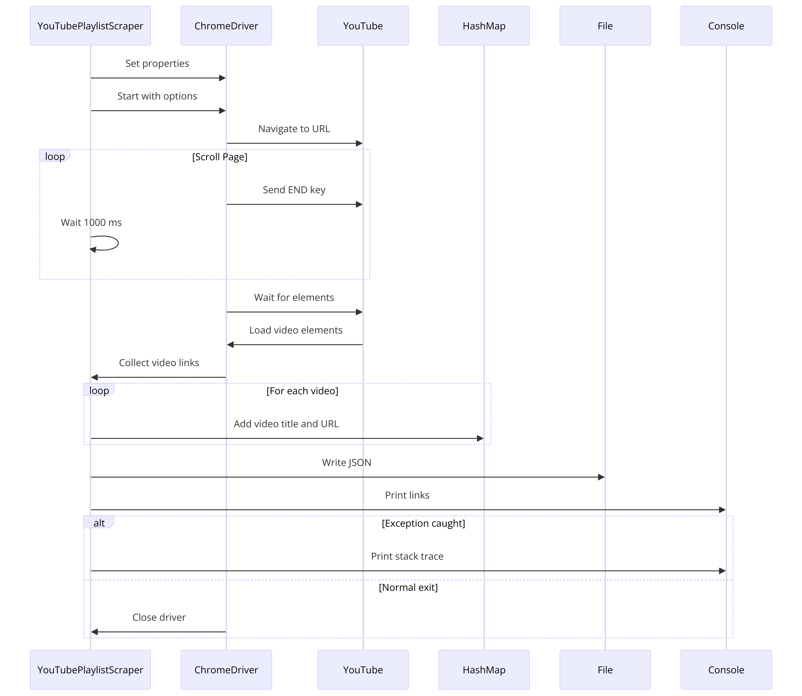
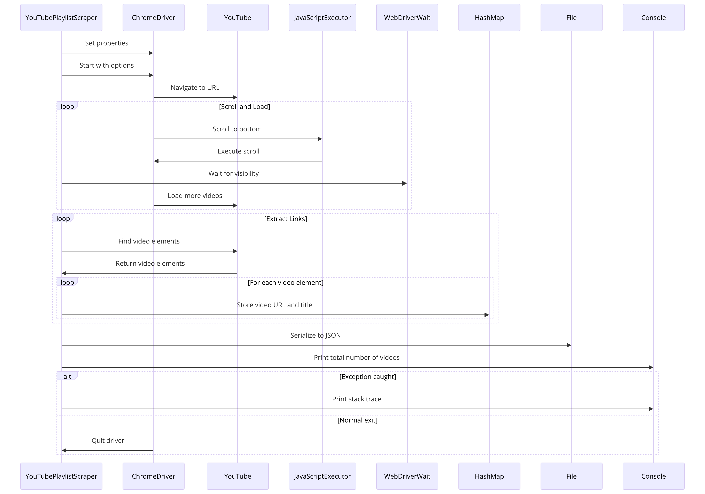

# refer:
1. https://chatgpt.com/g/g-WKIaLGGem-tech-support-advisor/c/4b5adde7-e7b9-4eac-aa5d-32db9ca6fdc5
2. https://chatgpt.com/g/g-WKIaLGGem-tech-support-advisor/c/8ab6a12b-25f1-4bfc-b05c-0ef7daa8c553

# sequence diagram
refer: https://chatgpt.com/g/g-5QhhdsfDj-diagrams-show-me-charts-presentations-code/c/ee1353ef-ddab-44c6-bb0d-2cb6dc99e1e0
1. https://diagrams.helpful.dev/s/s:63UoLUpE

2. https://diagrams.helpful.dev/s/s:M9uyyYp0


# run
> mvn clean compile
> 
> mvn exec:java
> 
> java YouTubePlaylistScraper "https://www.youtube.com/playlist?list=PL_oohi_O51Z_lORk8SCG_4x1smii5ky7f"


# Regex
In the context of your question, the regex `list=([^&]*)` is used to extract the value associated with the `list` parameter from a URL query string. Let’s break down what this regex pattern means and how it works:

### Regex Explanation: `list=([^&]*)`

- **`list=`**: This part of the pattern matches the literal string "list=" in the URL. It specifies that the regex should look for this exact sequence of characters.

- **`(`...`)`**: This is a capturing group that captures the part of the regex inside the parentheses. Capturing groups are used to extract information from a regex. Anything that matches inside the parentheses will be captured and can be accessed later.

- **`[^&]`**: This is a character class that matches any character that is not an ampersand (`&`). The caret (`^`) at the beginning of a character class acts as a negation. Since `&` is typically used to separate query parameters in URLs, this part of the regex is saying "match any character that is not a parameter separator."

- **`*`**: This quantifier matches zero or more of the preceding element. In this context, it applies to the `[^&]` character class. This means "match zero or more characters that are not `&`."

### Usage in Java

Here’s how you might see this regex used in a Java method:

```java
private static String extractByRegex(String url, String regex) {
    Pattern pattern = Pattern.compile(regex);
    Matcher matcher = pattern.matcher(url);
    if (matcher.find()) {
        return matcher.group(1);  // Returns the first captured group
    }
    return null;
}
```

In this method:
- `Pattern.compile(regex)` compiles the regex pattern for use.
- `pattern.matcher(url)` creates a `Matcher` object that can be used to find matches of the pattern in the specified URL.
- `matcher.find()` scans the URL and checks if the pattern is found.
- `matcher.group(1)` retrieves the first captured group from the pattern, which in the case of the regex `list=([^&]*)`, is the value of the `list` query parameter.

**Regex**, short for Regular Expression, is a sequence of characters that forms a search pattern. It can be used for string searching and manipulation, and is very powerful for extracting information from text based on patterns, validating formats (like email addresses or phone numbers), and transforming text in complex ways.

### How Regex Works

A regex pattern specifies rules which strings must follow. For example, `^a...s$` matches any five-letter string starting with 'a' and ending with 's'. Here's a breakdown of common regex components:

- **Anchors** — `^` and `$` match the start and end of a string, respectively.
- **Character Classes** — `[abc]` matches any single character from the set {a, b, c}. `[^abc]` matches any character not in the set.
- **Quantifiers** — `a+` matches one or more of 'a', `a*` matches zero or more of 'a', and `a?` matches zero or one of 'a'.
- **Groups** — `(abc)` matches the exact sequence 'abc'.
- **Ranges** — `[a-z]` matches any lowercase letter. `[0-9]` matches any digit.
- **Special characters** — `\s` matches any whitespace. `\d` matches any digit.

### How to Learn Regex

Learning regex can seem daunting due to its cryptic syntax, but here are some steps and resources that can help:

1. **Start with the Basics**:
   - Understand the core concepts like literals, metacharacters, and escape sequences.
   - Practice simple regex patterns, such as finding all digits in a text or replacing spaces with new lines.

2. **Interactive Tutorials**:
   - **RegexOne** (https://regexone.com/) offers a hands-on approach to learning regex with interactive exercises.
   - **Regex101** (https://regex101.com/) provides a real-time regex tester and debugger for JavaScript, Python, and PCRE.

3. **Read a Book**:
   - “Mastering Regular Expressions” by Jeffrey E.F. Friedl is an in-depth resource that covers how regex works across different tools and languages.

4. **Practice Problems**:
   - Websites like **Exercism** (https://exercism.io/) and **LeetCode** (https://leetcode.com/) have regex-related challenges that increase in complexity.
   - Try writing regexes to solve daily text manipulation tasks you encounter.

5. **Use Cheat Sheets**:
   - Cheat sheets condense the syntax and patterns of regex into a single quick-reference page.
   - **RexEgg** (http://www.rexegg.com/regex-quickstart.html) has cheat sheets and a multitude of tutorials ranging from beginner to advanced levels.

6. **Build Projects**:
   - Use regex in programming projects or scripts to parse logs, validate input data, or scrape websites. Practical application solidifies learning.
