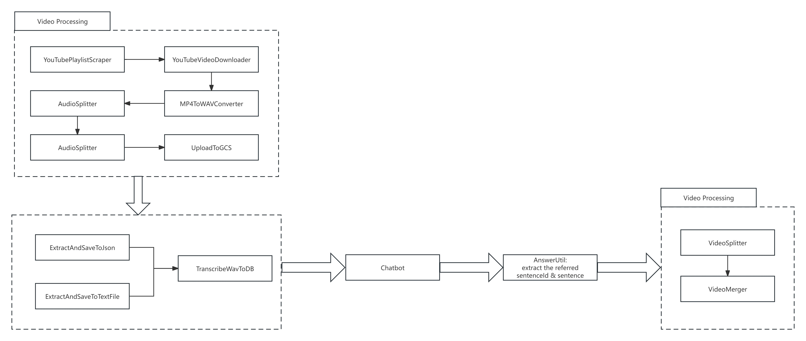
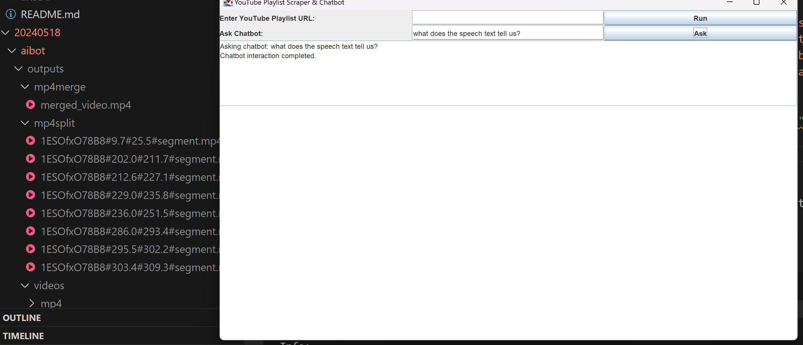

# Video Processing Chatbot Workflow
The project aims to:
1. scrap & download the youtube videos from the playlist based on the user's url input
2. process the mp4 video into wav and uplaod to google cloud
3. using Gemini 1.5 Pro to answer the user's input questions
4. process the videos based on the chatbot's answer and provide the merged videos
5. provide a UI for user's interaction & video's play

Please check code here: [[20240518/aibot](./aibot/)]





Please Check the Youtube here: [Youtube](https://www.youtube.com/watch?v=5UdBdVmkLuE&list=PLKJC3aN3a3EX_l5SXmpXMrILU4PlDnCyL)

## How to Run
1. login: https://cloud.google.com/vertex-ai/docs/start/cloud-environment?_gl=1*140nv1z*_ga*MTU3OTAwMzIwNS4xNzE1OTAwNTI3*_ga_WH2QY8WWF5*MTcxNjA0NzkyNi41LjEuMTcxNjA0ODU2MC4wLjAuMA..&_ga=2.162627196.-1579003205.1715900527&_gac=1.79751653.1716047927.CjwKCAjwo6GyBhBwEiwAzQTmc2Vi09CCLGuiOM39CosBpnSeKzeaMHZoIs0FYuC_l025W2gBf8nW9BoCOMoQAvD_BwE
> gcloud auth login --no-browser
> gcloud init

2. run project
> mvn clean install
> mvn javafx:run
> or
> mvn exec:java

# Refer
1. Retrieval Augmented Generation (RAG):
https://www.baeldung.com/java-langchain-basics#3-retrieval

2. google vertex ai gemini: https://github.com/GoogleCloudPlatform/java-docs-samples/tree/main/vertexai/snippets/src/main/java/vertexai/gemini
3. https://www.baeldung.com/java-langchain-basics
4. https://cloud.google.com/java/getting-started
   
5. https://cloud.google.com/sdk/docs/install
6. https://cloud.google.com/vertex-ai/docs/start/client-libraries
7. Official Doc(Java): https://cloud.google.com/vertex-ai/generative-ai/docs/start/quickstarts/quickstart-multimodal#gemini-setup-environment-java
8. google-cloud-vertexai overview (1.3.0): https://cloud.google.com/vertex-ai/generative-ai/docs/reference/java/latest/overview
9.  Overview of the Gemini API in Vertex AI: https://cloud.google.com/vertex-ai/generative-ai/docs/multimodal/overview
10. Java Generatiiveai: https://cloud.google.com/vertex-ai/generative-ai/docs/reference/java/latest/com.google.cloud.vertexai.generativeai
11. Java Generatiiveai Github: https://github.com/googleapis/google-cloud-java/tree/main/java-vertexai/google-cloud-vertexai/src/main/java/com/google/cloud/vertexai/generativeai
12. google-cloud-vertexai Java Github: https://github.com/googleapis/google-cloud-java/tree/main/java-vertexai
13. SafeSettings: https://cloud.google.com/vertex-ai/generative-ai/docs/multimodal/configure-safety-attributes#gemini-TASK-samples-java
14. Vertex AI console: https://console.cloud.google.com/vertex-ai/generative/multimodal/create/text?_ga=2.139574523.915233943.1715962077-1579003205.1715900527&_gac=1.79971813.1716047927.CjwKCAjwo6GyBhBwEiwAzQTmc2Vi09CCLGuiOM39CosBpnSeKzeaMHZoIs0FYuC_l025W2gBf8nW9BoCOMoQAvD_BwE&project=delta-coil-423603-j2

# Answer
## answer 4
```
[1ESOfxO78B8#9#PL_oohi_O51Z_lORk8SCG_4x1smii5ky7f#segment#0#00:00:09.700#00:00:25.500|let me let me Begin by thanking the staff for the board, ve done to prepare for today, 1ESOfxO78B8#9#PL_oohi_O51Z_lORk8SCG_4x1smii5ky7f#segment#2#00:00:23.500#00:00:46.700|our objective in organizing the series was to gather information that we and others can use to help develop policies that will support the flow of loans to credit where these small businesses for instance by identifying and addressing specific credit Caps or impediments to lending or improving access to small businesses to critical support services such as assistance in filing loan applications, 1ESOfxO78B8#9#PL_oohi_O51Z_lORk8SCG_4x1smii5ky7f#segment#3#00:00:04.000#00:00:23.100|before we get to the next steps however I would like to provide context by briefly discussing the importance of small businesses to job creation and the economic recovery reviewing the actions the Federal Reserve has taken the support small business financing and offering some observations about what we heard during the spa business meeting series, 1ESOfxO78B8#9#PL_oohi_O51Z_lORk8SCG_4x1smii5ky7f#segment#5#00:00:08.400#00:00:14.300|these efforts importantly have included working to facilitate the flow of credit to viable small businesses, 1ESOfxO78B8#9#PL_oohi_O51Z_lORk8SCG_4x1smii5ky7f#segment#5#00:00:15.500#00:00:24.300|at the Federal Reserve we helped bring capital from the Securities markets to small business to the term asset-backed Securities loan facility the towels program]
```
## answer 3
This speech discusses the importance of small businesses, particularly minority-owned ones, to job creation and the economic recovery. It highlights the challenges these businesses face in accessing credit, exacerbated by the recent recession. The speaker emphasizes the Federal Reserve's commitment to supporting small businesses through research, outreach programs, and collaboration with other agencies and organizations. They also mention the need for better data and analysis to understand and address the credit needs of small businesses.

`referList`: [
"let me let me Begin by thanking the staff for the board's division of consumer and Community Affairs especially two divisions director send bronstein for the hard work they've done to prepare for today's discussion about approving access to credit for Sound small businesses",
"small businesses are essential to creating jobs in our economy they employ roughly one half of all Americans and accounts for about 60% of gross job creation",
"clearly do to support the recovery we need to find ways to ensure the credit-worthy borrowers have access to needed loans",
"over the past two years the Federal Reserve and other agencies have made a concerted effort to stabilize our financial system in our economy",
"these efforts importantly have included working to facilitate the flow of credit to viable small businesses",
"I want to thank all of you for participating in the discussion today about the financing needs of small business quickly want to thank Karen Mills the SBA administrator for her remarks and our distinguished analyst for helping us better understand the Dynamics of small business lending in difficult Economic Times I'd also like to thank everyone who participated in the more than 40 Regional meetings that led up to today's conference and I think the reserve bank's for their sponsorship and coordination and organization of these meetings they brought together small businesses lenders technical assistance providers Bank examiners and others involved in small business credit to help identify barriers to small business credit access and just suggest potential Solutions as many of you know I come to the Federal Reserve after many years is a community Banker quite a number of those years were spent lending just",
"that experience gives me a deeper appreciation for the importance of credit to economic growth and the particular importance of small business lending to job creation and local communities as you might imagine the recent recent decline in the availability of credit to small businesses concerns me it is also it also concerns my colleagues across the Federal Reserve System",
"today's meeting has been referred to as a Capstone because it's summarize the information that we gathered but our conversation today makes it clear that this is just the beginning there's no single step that can be taken to cure what's ailing the business lending Market knows we've heard the causes for credit tightening or many",
"going to fold a and I want a menu for your stamina for your insights your commitment to helping us identify the next staff that all of us probably policymakers small business lenders nonprofits and small business owners can take to facilitate small businesses access to credit hope we can also count on each of you to continue the effort because it's going to take all of us working together to fully restore a healthy credit environment for the small businesses that are so important to our economy as we take as we think about taking the next episode of like to especially note the success of the Federal Reserve small business meeting Series in fostering collaboration among numerous federal agencies including the other Financial Regulatory Agencies the treasury cdfi",
"finding solutions to small business financing issues is not only an important component of the economic recovery it's also important for the restoration of communities that have been hard-hit by foreclosures in job losses what we've accomplished is a good beginning we've identified some specific credit gas and generated some ideas to tackle them we brought together a network of people with different perspectives and resources but a shared commitment to improving credit conditions and we sparked numerous research projects to further our understanding of the current and ongoing credit needs a small businesses if we continue to work together I'm sure that we can alleviate some of the problems that small businesses face the more we do now the better prepared our small businesses and lending institutions will be when economic growth and consumer demand pick up so thank you again for your participation today and your continued participation in the future",   
"much of our Outreach at the Federal Reserve has focused on the needs of small minority small businesses why all small businesses are vulnerable to economic downturns the recession has hit minority small business is particularly hard at our meetings we heard a number of comment citing a comparative lack of capitalization week or collateral values and lower credit scores from any minority small businesses which leads these forms with less ability to absorb economic shocks for a Los Angeles we heard that the decline in residential property values has had a significant adverse impact on businesses owned by Asian Pacific Islanders",
"finally spend some time today discussing the need for better data and Analysis"
]

`idList`: [
'1ESOfxO78B8#9#PL_oohi_O51Z_lORk8SCG_4x1smii5ky7f#segment#0#00:00:09.700#00:00:25.500',
'1ESOfxO78B8#9#PL_oohi_O51Z_lORk8SCG_4x1smii5ky7f#segment#3#00:00:25.000#00:00:34.700',
'1ESOfxO78B8#9#PL_oohi_O51Z_lORk8SCG_4x1smii5ky7f#segment#4#00:00:50.000#00:00:57.400',
'1ESOfxO78B8#9#PL_oohi_O51Z_lORk8SCG_4x1smii5ky7f#segment#5#00:00:00.500#00:00:07.200',
'1ESOfxO78B8#9#PL_oohi_O51Z_lORk8SCG_4x1smii5ky7f#segment#5#00:00:08.400#00:00:14.300',
'epYOKjcEsz8#3#PL_oohi_O51Z_lORk8SCG_4x1smii5ky7f#segment#0#00:00:09.400#00:00:58.800',
'epYOKjcEsz8#3#PL_oohi_O51Z_lORk8SCG_4x1smii5ky7f#segment#1#00:00:00.000#00:00:24.900',
'epYOKjcEsz8#3#PL_oohi_O51Z_lORk8SCG_4x1smii5ky7f#segment#2#00:00:00.000#00:00:58.900',
'epYOKjcEsz8#3#PL_oohi_O51Z_lORk8SCG_4x1smii5ky7f#segment#3#00:00:00.000#00:00:59.000',
'epYOKjcEsz8#3#PL_oohi_O51Z_lORk8SCG_4x1smii5ky7f#segment#11#00:00:23.800#00:00:58.500',
'epYOKjcEsz8#3#PL_oohi_O51Z_lORk8SCG_4x1smii5ky7f#segment#12#00:00:36.400#00:00:58.200',
'epYOKjcEsz8#3#PL_oohi_O51Z_lORk8SCG_4x1smii5ky7f#segment#13#00:00:00.000#00:00:51.800'
]

## answer 1
this is the answer: The speech text tells us that the Federal Reserve is committed to supporting small businesses by conducting research and outreach programs to help small business owners access financing and technical assistance. The Federal Reserve also encourages bank examiners to adopt a balanced approach to reviewing bank lending to small businesses.

`referList`: [
"I want to thank all of you for participating in the discussion today about the financing needs of small business quickly want to thank Karen Mills the SBA administrator for her remarks and our distinguished analyst for helping us better understand the Dynamics of small business lending in difficult Economic Times I'd also like to thank everyone who participated in the more than 40 Regional meetings that led up to today's conference and I think the reserve bank's for their sponsorship and coordination and organization of these meetings they brought together small businesses lenders technical assistance providers Bank examiners and others involved in small business credit to help identify barriers to small business credit access and just suggest potential Solutions as many of you know I come to the Federal Reserve after many years is a community Banker quite a number of those years were spent lending just",
"businesses that were the backbone of my local economy that experience gives me a deeper appreciation for the importance of credit to economic growth and the particular importance of small business lending to job creation and local communities as you might imagine the recent recent decline in the availability of credit to small businesses concerns me it is also it also concerns my colleagues across the Federal Reserve System",
"when the mortgage crisis first broke out a few years ago we were able to build a body of data and understanding of relevant issues through a series of meetings convened by the federal reserve banks across the country on topics such as foreclosure or neighborhood stabilization we started hearing more about problems that were encountered by small businesses and accessing credit we again tap the broad footprint of the reserve bank's system and the web of local contacts if they had developed to help us better understand issues surrounding loans to small business attended one of the regional meetings in June and I was please",
"do all that they can to meet the needs of credit-worthy borrowers while maintaining appropriately prudent underwriting standards",
"financial Regulators have issued guidance to provide Clarity and consistency regarding the supervisory treatment of new loans problem loans and different loan workout approaches because we understand how important regulatory certainty is to Bankers who must then make the decisions about whether and to whom they should lend the interagency guidance stress the importance of continuing to make prudent loans the credit where the customers clarified standards for commercial real estate loans in workouts and most recently restated supervisor reviews on lending to small businesses at the Federal Reserve we have complimented The Guidance with training program for examiners and Outreach to the banking industry that underscores the importance of sound lending practices"
]

`idList`: [
'epYOKjcEsz8#0#PL_oohi_O51Z_lORk8SCG_4x1smii5ky7f#segment#0#00:00:09.400#00:00:58.800',
'epYOKjcEsz8#1#PL_oohi_O51Z_lORk8SCG_4x1smii5ky7f#segment#0#00:00:00.000#00:00:24.900',
'epYOKjcEsz8#2#PL_oohi_O51Z_lORk8SCG_4x1smii5ky7f#segment#0#00:00:00.000#00:00:16.100',
't7jGBSaBmTc#6#PL_oohi_O51Z_lORk8SCG_4x1smii5ky7f#segment#0#00:00:00.000#00:00:20.400',
'epYOKjcEsz8#6#PL_oohi_O51Z_lORk8SCG_4x1smii5ky7f#segment#0#00:00:00.000#00:00:14.200'
]

## answer 2
this is the answer: The text provides information from four different events:

**Event 1: Federal Reserve Board Gathering**

* **Focus:** Addressing the financing needs of small businesses, particularly access to credit.
* **Context:** This gathering was a culmination of over 40 meetings held nationwide to understand the challenges facing small businesses.
* **Key Takeaways:**
    * Small businesses are crucial for job creation and economic recovery.
    * Credit conditions remain difficult for small businesses.
    * Collaboration between lenders, regulators, and small business owners is essential.
    * Declining collateral values pose a significant challenge for small businesses seeking loans.
    * Lenders need to find ways to assess creditworthiness in uncertain economic times.
    * Policymakers need to develop policies that support the flow of credit to creditworthy small businesses.

**Event 2: FedNow Early Adopter Workshop**

* **Focus:** Introducing the FedNow instant payment service, scheduled to launch between May and July 2023.
* **Key Takeaways:**
    * FedNow will transform everyday payments, offering instant transactions and immediate fund availability.
    * The service will benefit households and businesses, especially those with cash flow constraints.
    * FedNow's cloud-based design ensures scalability, resilience, and continuous service.
    * Financial institutions and service providers need to invest in upgrading payment infrastructure to support instant payments.

**Event 3: Conversation with Federal Reserve Chairman Ben Bernanke**

* **Focus:** A session for educators on the role of the Federal Reserve and the importance of economic and financial literacy.  
* **Key Takeaways:**
    * Economics helps students understand the free market system and its impact on living standards.
    * The recent financial crisis highlights the importance of personal financial literacy.
    * Students need to understand the benefits and risks of borrowing and managing debt.
    * The Federal Reserve supports financial literacy and economic education through various programs and resources.

**Event 4: Speech by Randal Quarles, Vice Chair for Supervision of the Federal Reserve**

* **Focus:** The Federal Reserve's role in insurance regulation and supervision.
* **Key Takeaways:**
    * The insurance industry has performed well during the COVID-19 pandemic.
    * The Federal Reserve is monitoring the impact of low interest rates on life insurers.
    * The Federal Reserve is developing a capital rule for insurance depository institutions holding companies.
    * The Federal Reserve is working with international regulators on insurance capital standards.
    * The Federal Reserve is developing a tailored supervisory framework for insurance savings and loan holding companies.      
    * Climate change is an emerging risk that the Federal Reserve is monitoring.


**referList=**

1. **1ESOfxO78B8#9#PL_oohi_O51Z_lORk8SCG_4x1smii5ky7f#segment#0#00:00:09.700#00:00:25.500|let me let me Begin by thanking the staff for the board's division of consumer and Community Affairs especially two divisions director send bronstein for the hard work they've done to prepare for today's discussion about approving access to credit for Sound small businesses**
    * This segment highlights the importance of the discussion on small business credit access.
2. **1ESOfxO78B8#9#PL_oohi_O51Z_lORk8SCG_4x1smii5ky7f#segment#0#00:00:26.700#00:00:39.600|and thanks also to the many partners who helped us to organize today's event Tiffany the small business administration and the treasury's community development financial institutions fund I'm pleased to welcome all of you to the Federal Reserve board**
    * This segment acknowledges the collaborative effort of various organizations in organizing the event.
3. **1ESOfxO78B8#9#PL_oohi_O51Z_lORk8SCG_4x1smii5ky7f#segment#0#00:00:40.900#00:00:55.700|this Gathering addressing the financing needs of small businesses serves as a Capstone for a series of more than 40 meetings conducted across the country starting in February organized by the Federal Reserve systems Community Affairs offices**
    * This segment emphasizes the event's significance as a culmination of nationwide discussions on small business financing needs.
4. **1ESOfxO78B8#9#PL_oohi_O51Z_lORk8SCG_4x1smii5ky7f#segment#0#00:00:56.800#00:00:59.000|these meetings provided forms for small**
    * This segment introduces the purpose of the regional meetings.
5. **1ESOfxO78B8#9#PL_oohi_O51Z_lORk8SCG_4x1smii5ky7f#segment#1#00:00:00.000#00:00:15.200|business owners trade association's lenders Bank supervisors federal state and local government officials and other stakeholders to exchange ideas about the challenges facing small businesses both in the short run and in the longer term**
    * This segment lists the diverse stakeholders who participated in the regional meetings.
6. **1ESOfxO78B8#9#PL_oohi_O51Z_lORk8SCG_4x1smii5ky7f#segment#1#00:00:17.400#00:00:41.100|some of these meetings were small-group discussions While others were larger sessions that is address to Pacific topics such as minority entrepreneurship or guaranteed loan programs free sample of Sandy mention I attend a meeting in Detroit the combined a general discussion of small business credit issues with a session focusing on specific case if the Flyers to the Auto industry many which are small and medium-sized firms**
    * This segment provides examples of the topics and formats of the regional meetings.
7. **1ESOfxO78B8#9#PL_oohi_O51Z_lORk8SCG_4x1smii5ky7f#segment#1#00:00:42.500#00:00:57.100|participants in that session highlighted the interconnectedness of the auto supply chain and The crucial role of stable financing for small businesses ranging from Parts suppliers to Independent automobile dealers in the recovery of the Auto industry as a whole**
    * This segment emphasizes the importance of stable financing for small businesses in the auto industry's recovery.
8. **1ESOfxO78B8#9#PL_oohi_O51Z_lORk8SCG_4x1smii5ky7f#segment#1#00:00:58.500#00:00:58.900|this**
    * Incomplete segment.
9. **1ESOfxO78B8#9#PL_oohi_O51Z_lORk8SCG_4x1smii5ky7f#segment#10#00:00:00.000#00:00:07.000|as much as a return to more traditional underwriting standards following a period where standards were two lakhs**
    * This segment suggests a shift in lending practices towards more traditional underwriting standards.
10. **1ESOfxO78B8#9#PL_oohi_O51Z_lORk8SCG_4x1smii5ky7f#segment#10#00:00:08.100#00:00:29.700|but those some lender said they were emphasizing cash flow and relying less than collateral values in evaluating creditworthiness it does seem clear that some credit worthy but his businesses including some who collateral has lost value but whose cash flows remain strong have had difficulty obtaining the credit that they need to expand and in some cases even to continue operating**
    * This segment highlights the challenges faced by creditworthy businesses in obtaining credit due to changes in lending practices.
11. **1ESOfxO78B8#9#PL_oohi_O51Z_lORk8SCG_4x1smii5ky7f#segment#10#00:00:31.000#00:00:38.500|the challenge ahead for lenders will be to determine how to assess the credit quality of businesses in an uncertain and difficult economic environment**
    * This segment acknowledges the difficulties lenders face in assessing creditworthiness in a challenging economic climate.  
12. **1ESOfxO78B8#9#PL_oohi_O51Z_lORk8SCG_4x1smii5ky7f#segment#10#00:00:40.000#00:00:57.700|it is in lenders interest after all to lender credit really borrowers ultimately that's how they earn their profits and Regulators for their part need to continue to work with lenders to help them do all that they prudently can to meet the needs of credit where these small businesses**      
    * This segment emphasizes the shared interest of lenders and regulators in supporting creditworthy small businesses.        
13. **1ESOfxO78B8#9#PL_oohi_O51Z_lORk8SCG_4x1smii5ky7f#segment#11#00:00:01.200#00:00:10.100|making credit accessible to sound small businesses is crucial to our economic recovery and so should be front-and-center among our current policy challenges**      
    * This segment reiterates the importance of small business credit access for economic recovery.
14. **1ESOfxO78B8#9#PL_oohi_O51Z_lORk8SCG_4x1smii5ky7f#segment#11#00:00:11.400#00:00:31.200|we are very pleased that you've accepted our invitation to participate in today's discussion of next steps in the efforts to promote found small business finance you each bring valuable insights in perspective to this issue and I'd very much like to thank each and everyone of you for your willingness to share your ideas thank you and the best for a good discussion today**
    * This segment expresses gratitude to the participants for their contributions to the discussion.
15. **1ESOfxO78B8#9#PL_oohi_O51Z_lORk8SCG_4x1smii5ky7f#segment#2#00:00:00.000#00:00:02.300|of course just one meeting in one city**
    * Incomplete segment.
16. **1ESOfxO78B8#9#PL_oohi_O51Z_lORk8SCG_4x1smii5ky7f#segment#2#00:00:03.200#00:00:07.300|I'm eating in Miami focused on the needs of hispanic-owned small businesses**
    * This segment provides


`referList=`
- `small businesses are essential to creating jobs in our economy they employ roughly one half of all Americans and accounts for about 60% of gross job creation`
- `clearly do to support the recovery we need to find ways to ensure the credit-worthy borrowers have access to needed loans`   
- `over the past two years the Federal Reserve and other agencies have made a concerted effort to stabilize our financial system in our economy`
- `these efforts importantly have included working to facilitate the flow of credit to viable small businesses`
- `the insights we obtained from small business owners lenders and others in this series of meetings have given us a more nuanced understanding of the problem and will help us identify areas where we might be able to do more`
- `finding solutions to small business financing issues is not only an important component of the economic recovery it's also important for the restoration of communities that have been hard-hit by foreclosures in job losses what we've accomplished is a good beginning we've identified some specific credit gas and generated some ideas to tackle them we brought together a network of people with different perspectives and resources but a shared commitment to improving credit conditions and we sparked numerous research projects to further our understanding of the current and ongoing credit needs a small businesses if we continue to work together I'm sure that we can alleviate some of the problems that small businesses face the more we do now the better prepared our small businesses and lending institutions will be when economic growth and consumer demand pick up so thank you again for your participation today and your continued participation in the future`

# Freq Error
[ERROR] Failed to execute goal org.codehaus.mojo:exec-maven-plugin:3.0.0:java (default-cli) on project youtube-playlist-scraper: An exception occured while executing the Java class. The response is blocked due to unauthorized citations. -> [Help 1]
[ERROR]

## Error log2: java.lang.IllegalThreadStateException
**Solution:**
> mvn clean install -T 4

```
java.lang.IllegalThreadStateException
    at java.lang.ThreadGroup.destroy (ThreadGroup.java:776)
    at org.codehaus.mojo.exec.ExecJavaMojo.execute (ExecJavaMojo.java:293)
    at org.apache.maven.plugin.DefaultBuildPluginManager.executeMojo (DefaultBuildPluginManager.java:137)
    at org.apache.maven.lifecycle.internal.MojoExecutor.doExecute2 (MojoExecutor.java:370)
    at org.apache.maven.lifecycle.internal.MojoExecutor.doExecute (MojoExecutor.java:351)
    at org.apache.maven.lifecycle.internal.MojoExecutor.execute (MojoExecutor.java:215)
    at org.apache.maven.lifecycle.internal.MojoExecutor.execute (MojoExecutor.java:171)
    at org.apache.maven.lifecycle.internal.MojoExecutor.execute (MojoExecutor.java:163)
    at org.apache.maven.lifecycle.internal.LifecycleModuleBuilder.buildProject (LifecycleModuleBuilder.java:117)
    at org.apache.maven.lifecycle.internal.LifecycleModuleBuilder.buildProject (LifecycleModuleBuilder.java:81)
    at org.apache.maven.lifecycle.internal.builder.singlethreaded.SingleThreadedBuilder.build (SingleThreadedBuilder.java:56)      
    at org.apache.maven.lifecycle.internal.LifecycleStarter.execute (LifecycleStarter.java:128)
    at org.apache.maven.DefaultMaven.doExecute (DefaultMaven.java:294)
    at org.apache.maven.DefaultMaven.doExecute (DefaultMaven.java:192)
    at org.apache.maven.DefaultMaven.execute (DefaultMaven.java:105)
    at org.apache.maven.cli.MavenCli.execute (MavenCli.java:960)
    at org.apache.maven.cli.MavenCli.doMain (MavenCli.java:293)
    at org.apache.maven.cli.MavenCli.main (MavenCli.java:196)
    at jdk.internal.reflect.NativeMethodAccessorImpl.invoke0 (Native Method)
    at jdk.internal.reflect.NativeMethodAccessorImpl.invoke (NativeMethodAccessorImpl.java:62)
    at jdk.internal.reflect.DelegatingMethodAccessorImpl.invoke (DelegatingMethodAccessorImpl.java:43)
    at java.lang.reflect.Method.invoke (Method.java:566)
    at org.codehaus.plexus.classworlds.launcher.Launcher.launchEnhanced (Launcher.java:282)
    at org.codehaus.plexus.classworlds.launcher.Launcher.launch (Launcher.java:225)
    at org.codehaus.plexus.classworlds.launcher.Launcher.mainWithExitCode (Launcher.java:406)
    at org.codehaus.plexus.classworlds.launcher.Launcher.main (Launcher.java:347)
```

## Error log3: java.lang.IllegalArgumentException: The response is blocked due to unauthorized citations
```
java.lang.IllegalArgumentException: The response is blocked due to unauthorized citations.
    at com.google.cloud.vertexai.generativeai.ResponseHandler.checkFinishReason (ResponseHandler.java:189)
    at com.google.cloud.vertexai.generativeai.ResponseHandler.getText (ResponseHandler.java:46)
    at com.example.Chatbot.textInput (Chatbot.java:97)
    at com.example.Chatbot.main (Chatbot.java:36)
    at org.codehaus.mojo.exec.ExecJavaMojo$1.run (ExecJavaMojo.java:254)
    at java.lang.Thread.run (Thread.java:829)
```