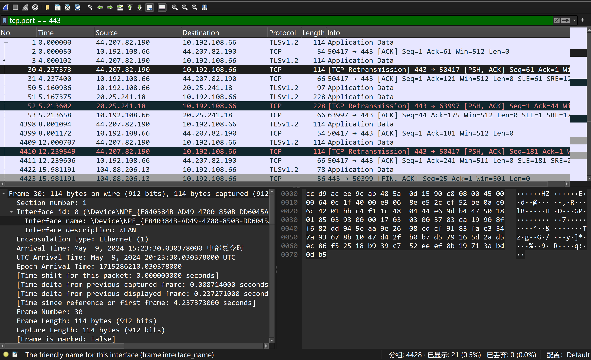

1. https://zhuanlan.zhihu.com/p/668870862
2. https://baijiahao.baidu.com/s?id=1739389078675907136&wfr=spider&for=pc
3. https://baijiahao.baidu.com/s?id=1751431327666832437&wfr=spider&for=
4. https://www.jianshu.com/p/9b9438dff7a2?ivk_sa=1024320u
5. https://www.xiaolincoding.com/network/1_base/what_happen_url.html#%E7%9C%9F%E5%AE%9E%E5%9C%B0%E5%9D%80%E6%9F%A5%E8%AF%A2-dns 键入网址到网页显示，期间发生了什么？
6. https://blog.csdn.net/2301_76524931/article/details/133846107
7. https://www.youtube.com/watch?v=M19XC0zJUrA
8. https://github.com/Java-Techie-jt

# 更加专业且技术含量较高地实现通过编写代码下载YouTube播放列表的视频:配合网络抓包
如果你希望更加专业且技术含量较高地实现通过编写代码下载YouTube播放列表的视频，配合网络抓包确实是一种可行的方法。使用网络抓包可以帮助你理解YouTube页面如何加载和请求视频数据，从而更准确地模拟这些请求以编程方式下载视频。这里提供一些步骤和建议，以帮助你实现这一过程：

### 1. 使用网络抓包工具
使用如Wireshark这样的网络抓包工具可以让你捕捉到从YouTube服务器到你的浏览器之间的所有HTTP请求和响应。通过分析这些数据，你可以确定哪些请求是用于视频流的，并理解这些请求的构成。

- **安装和配置Wireshark**：安装Wireshark，并开始捕获与你的网卡相关的数据包。
- **过滤HTTP或HTTPS流量**：使用Wireshark的过滤功能，只查看与HTTP或HTTPS（YouTube现在大多使用HTTPS）相关的数据包。
- **访问YouTube并播放视频**：在Wireshark运行的同时，访问YouTube并播放一个视频，观察生成的流量。
- **分析特定的视频请求**：找到与视频加载相关的请求，注意请求的URL、请求头、响应头以及任何可能的令牌或cookie。

### 2. 模拟HTTP请求
一旦你理解了这些HTTP请求的构成，你可以使用Java来模拟这些请求。这通常涉及设置正确的HTTP头，包括用户代理、认证令牌和cookie。

- **使用Java网络库**：你可以使用像Apache HttpClient或者Java的原生HttpURLConnection来构造请求。
- **设置请求头**：确保包括所有必要的请求头，这样服务器才会将你的请求视为合法的浏览器请求。
- **发送请求并接收响应**：发送请求并处理响应，特别是那些包含视频数据的响应。

### 3. 处理视频数据
处理和下载视频流可能需要处理不同的数据格式，比如MP4或WebM。这可能还涉及到解析和合并视频和音频流，因为YouTube通常将它们分开发送。

- **解析视频数据**：根据抓包结果，解析实际的视频数据流。
- **下载并保存文件**：将视频数据流写入文件。

### 4. 保持更新和处理异常
- **适应网站变化**：YouTube的前端和后端逻辑会不定期更新，需要定期检查和更新你的代码以适应这些变化。
- **错误处理**：实现异常处理机制，确保对诸如网络错误、数据格式变更等情况做出反应。

### 5. 专业化的改进
- **多线程下载**：实现多线程或异步下载，以优化下载速度和处理能力。
- **用户界面**：为你的下载工具添加图形用户界面（GUI），以提高用户体验。
- **配置化**：允许用户配置下载选项，例如视频质量、下载路径等。

### 注意法律和合规性
再次强调，下载YouTube视频可能涉及法律风险，特别是如果这些视频受版权保护。确保你的使用符合法律和道德标准，尽可能仅用于教育或个人学习目的，并且不违反YouTube的服务条款。

# 以较高技术含量的方式获取YouTube播放列表中的所有视频
为了以较高技术含量的方式获取YouTube播放列表中的所有视频，可以采用一系列技术手段，这不仅涉及网络抓包分析，还可能包括对网络协议的深入理解和程序设计。下面将提供一个详细的技术路径，供你参考：

### 步骤1: 网络抓包分析
首先，你需要使用网络抓包工具（如Wireshark）来捕获访问YouTube播放列表时的网络通信。通过这一步，你可以找到加载视频列表和视频数据的关键HTTP请求。

- **安装Wireshark**，设置过滤规则，只捕获与YouTube相关的流量。
- **访问YouTube播放列表**，播放视频，观察和记录请求的URL、请求头和响应头等信息。

### 步骤2: 解析HTTP请求
利用捕获的数据，分析如何通过HTTP请求获取播放列表中的所有视频链接。这可能涉及到分析JavaScript或JSON响应，以找出如何请求视频元数据和实际的视频流。

- **使用Java的Jsoup库** 解析HTML和内嵌的JavaScript，找出API请求或直接嵌入的视频信息。
- **通过Java代码** 构造和发送这些请求，获取播放列表中每个视频的详细信息。

### 步骤3: 编写Java代码以模拟请求
根据抓包得到的信息，使用Java编写代码以模拟这些请求，获取所有视频的详细信息和下载链接。

- **使用Java的HttpClient** 或 **HttpURLConnection** 来发送网络请求。
- **设置必要的请求头**，如`User-Agent`、`Authorization` (如果需要)等，确保请求被YouTube服务器接受。

### 步骤4: 下载视频
一旦获取到视频流的链接（注意这些链接通常有时间限制），使用Java进行视频下载。

- **使用Java NIO库**（如`Channels`和`ByteBuffer`）进行高效的文件传输。
- **多线程下载**：为每个视频创建一个线程或使用`ExecutorService`来管理多线程，以提高下载效率。

### 步骤5: 整合和优化
整合前面的步骤，建立一个完整的应用程序，包括错误处理、重试机制、用户界面等。

- **建立图形用户界面**（使用Swing或JavaFX），使用户可以输入播放列表URL，选择下载质量和保存位置。
- **实现日志记录和错误处理**，确保程序的健壮性和用户友好性。

### 步骤6: 遵守法律和道德规范
在进行开发前和使用过程中，始终确保遵守YouTube的使用条款，以及相关的法律和道德标准。考虑到版权保护的问题，确保你的用途是合法的，比如仅供个人学习和研究使用。

### 示例代码概念
这里提供一个Java中发送HTTP请求的简单示例代码：

```java
import java.io.*;
import java.net.HttpURLConnection;
import java.net.URL;

public class SimpleHttpDownloader {
    public static void downloadFile(String requestUrl, String savePath) throws IOException {
        URL url = new URL(requestUrl);
        HttpURLConnection connection = (HttpURLConnection) url.openConnection();
        connection.setRequestMethod("GET");
        connection.setRequestProperty("User-Agent", "Mozilla/5.0");

        try (BufferedInputStream in = new BufferedInputStream(connection.getInputStream());
             FileOutputStream fileOutputStream = new FileOutputStream(savePath)) {
            byte[] dataBuffer = new byte[1024];
            int bytesRead;
            while ((bytesRead = in.read(dataBuffer, 0, 1024)) != -1) {
                fileOutputStream.write(dataBuffer, 0, bytesRead);
            }
        }
        connection.disconnect();
    }

    public static void main(String[] args) {
        try {
            downloadFile("YOUR_VIDEO_URL_HERE", "path/to/download/video.mp4");
        } catch (IOException e

) {
            e.printStackTrace();
        }
    }
}
```

请将 `"YOUR_VIDEO_URL_HERE"` 替换为你通过分析获得的视频下载链接。这只是一个示例，实际的应用将更复杂，包括处理多个文件和格式，以及错误处理。

# 4K Video Downloader涉及的技术
制作一个类似于4K Video Downloader的应用，实质上是创建一个能够分析YouTube视频播放列表并下载高质量视频的工具。这样的工具会涉及到多个技术领域，包括网络通信、多媒体处理、用户界面设计等。

### 1. **网络通信与数据抓取**
这是构建视频下载器的核心技术之一。应用需要能够发送HTTP请求以获取视频播放页面，然后从中解析和提取视频数据链接。
- **HTTP/HTTPS客户端**：用于发送网络请求和接收响应。Java中可以使用`HttpClient`或者第三方库如Apache HttpClient。
- **HTML/JavaScript解析器**：如Jsoup或者其他DOM解析工具，用于解析YouTube页面和提取视频元数据。

### 2. **视频数据解码与处理**
下载视频数据通常涉及处理不同的编码格式。视频链接可能指向包含多种分辨率和编码格式的多个视频流。
- **多媒体处理库**：处理视频和音频流的合并、格式转换。例如，使用FFmpeg来合并下载的视频和音频流，转换视频格式等。

### 3. **多线程和并发处理**
为了提高下载速度和效率，视频下载器通常会利用多线程技术来同时下载视频文件或视频文件的不同部分。
- **Java并发库**：使用`Thread`, `Runnable`, `Callable`, `Future`, `ExecutorService`等来管理多线程任务，实现异步下载。

### 4. **用户界面设计**
用户界面使得非技术用户可以方便地使用工具，输入URL，选择下载格式和质量，查看下载进度等。
- **JavaFX或Swing**：用于构建图形用户界面。
- **响应式设计**：确保用户界面在不同的设备和屏幕尺寸上工作良好。

### 5. **安全性和身份验证**
如果涉及到需要登录的内容或者API使用，需要处理安全性和身份验证。
- **OAuth**：YouTube API需要OAuth来验证用户身份。
- **安全传输**：确保所有数据传输都通过HTTPS进行，保证通信安全。

### 6. **错误处理和日志记录**
健壮的错误处理和详细的日志记录对于确保下载器稳定运行和问题追踪至关重要。
- **异常处理**：捕获和处理网络错误、文件IO错误等。
- **日志框架**：如Log4j或SLF4J，记录程序的运行情况和重要事件。

4K Video Downloader可能还使用了其他专有技术和优化策略，这些可能没有公开详细信息。但上述技术组件为构建类似功能的应用提供了一个坚实的基础。如果你打算开发一个类似的应用，考虑这些技术是一个很好的起点。

# Challenges
While the specific inner workings of 4K Video Downloader are not publicly disclosed due to proprietary reasons, we can surmise its functionality based on common techniques used in video downloading and media handling software. Here’s a more detailed exploration of the techniques that such a tool likely employs to facilitate the downloading of videos from services like YouTube:

### 1. **Network Traffic Analysis and URL Extraction**
One of the core features of a tool like 4K Video Downloader would be its ability to analyze network traffic to extract the actual URLs where video content is streamed. This involves:

- **HTTP Sniffing**: The application might simulate browser requests and capture the resulting HTTP traffic to extract video URLs. This is likely done by intercepting data packets that contain video streaming information.
- **Decoding Stream URLs**: These tools need to parse and decode the dynamically generated stream URLs, which often include various parameters that could denote video quality, format, and a token for access control.

### 2. **Media Segmentation and Handling**
Since modern streaming platforms use adaptive bitrate streaming technologies like HLS (HTTP Live Streaming) or DASH (Dynamic Adaptive Streaming over HTTP), the downloader needs to handle different segments of video and audio:

- **Segmented Downloading**: Videos are often divided into multiple small segments. A sophisticated downloader would manage the downloading of these segments in parallel or sequentially.
- **Merging Segments**: After downloading video and audio segments, these need to be merged into a single file. This often requires understanding of container formats like MP4, MKV, etc.

### 3. **Video Decryption**
Some video content, especially those that are part of paid or subscription services, may be encrypted using DRM (Digital Rights Management). While it's illegal and against service terms to bypass DRM, a legal video downloader would only work with non-DRM protected streams.

### 4. **User Interface and Interaction**
A user-friendly interface is crucial for allowing users to interact with the software effectively:

- **Link Parsing**: Users can paste links of videos or playlists, and the software parses these links to identify downloadable content.
- **Quality Selection**: Users can select the quality of the video they wish to download. The tool shows the different available resolutions and formats.

### 5. **Concurrency and Threading**
To optimize the download speeds, sophisticated downloaders utilize multi-threading:

- **Multi-threading**: Parallel downloading of video segments or multiple videos at once can significantly reduce download time.
- **Asynchronous Operations**: GUI responsiveness is maintained by handling downloading processes in background threads.

### 6. **Compliance and Security**
Ensuring that the software adheres to legal standards and respects copyright rules is crucial:

- **Compliance Checks**: The software must check if the content is legally downloadable and alert users if it is not.
- **Secure Connections**: Utilizing HTTPS for all connections to prevent interception of data.

### 7. **Configuration and Customization**
Offering options for customization like download path selection, automatic conversion to other formats, and perhaps integration with other media tools.

These descriptions provide a high-level view of what 4K Video Downloader might employ in terms of technology and methodology. Real implementations could vary and may involve more specialized or proprietary techniques that enhance performance, usability, and compliance with legal standards.

# WireShark Capture Meaning


### 1. 数据包列表
- **No.**：数据包的序号，表示捕获到的数据包的顺序。
- **Time**：相对于第一个捕获的数据包的时间戳，单位是秒。
- **Source**：发送数据包的源IP地址。
- **Destination**：接收数据包的目标IP地址。
- **Protocol**：数据包使用的协议，例如TCP或TLSv1.2。
- **Length**：数据包的长度，单位是字节。
- **Info**：包含关于该数据包的更多信息，例如TCP的序列号、确认号、标志位状态等。

### 2. 选中的数据包详细信息
当你在Wireshark中选中一个特定的数据包时，下方会显示该数据包的详细信息，这通常分为几个部分：

- **Frame**：显示物理层相关的信息，包括数据包的实际长度和捕获长度等。
- **Ethernet**：展示以太网层的信息，如源MAC地址和目标MAC地址。（这部分在截图中未显示）
- **Internet Protocol**：显示IP层的信息，包括版本、头部长度、服务类型、总长度、标识、标志、片偏移、生存时间、协议、头部校验和、源IP地址和目标IP地址。（这部分在截图中未完全显示）
- **Transmission Control Protocol (TCP)**，或其他协议如TLS：显示传输层的信息，如源端口和目标端口、序列号、确认号、头部长度、标志位（如SYN, ACK等）、窗口大小、校验和等。

### 3. 协议分析
在“Info”栏中的描述可以帮助你快速识别数据包的作用：
- **Application Data**：表示这是应用数据传输，常见于HTTPS加密传输。
- **ACK**：确认号，用于TCP连接的稳定和确认。
- **PSH, ACK**：PSH标志表示“推送”，通常用于通知接收端立即处理这些数据。
- **FIN, ACK**：FIN标志表示发送端完成了发送任务，希望终止连接，这常常出现在通信结束时。

### 4. 使用过滤器
你当前应用了一个过滤器 `tcp.port == 443`，这意味着Wireshark只显示目标端口或源端口为443的TCP数据包，443端口通常用于HTTPS协议，用于安全的Web浏览数据传输。

### 实用技巧
通过查看特定的数据包和它们的详细信息，你可以对网络活动有深入的了解，例如，检查网络延迟问题、连接问题或分析特定应用的网络行为。每一列和每一个值都为网络的诊断提供了关键的线索。

### 计算机网络基础概念

1. **网络模型**
   - **OSI七层模型**：从物理层到应用层，每层都有特定的功能和协议。

| OSI七层模型                 | 功能                                                                                                   | 对应网络协议                               |
|----------------------------|--------------------------------------------------------------------------------------------------------|-------------------------------------------|
| 应用层(Application Layer)  | 为不同功能的应用（浏览器、邮件、远程传输等），提供相应的协议，例如：浏览器通过 HTTP协议获得数据以供使用，发生错误时，浏览器对应用进行处理 | HTTP，HTTPS，FTP，TELNET，SSH，SMTP，POP3等 |
| 表示层(Presentation Layer) | 将来自应用层的的数据，转换为网络标准格式的数据传给会话层（处理编码，数据转换和加密解密）                  | 没有协议                                   |
| 会话层(Session Layer)      | 主要功能是维护和协调会话之间的数据通信（何时建立连接、何时断开连接、连接保持多久）                        | 没有协议                                   |
| 传输层(Transport Layer)    | 从会话层获得数据，在必要时进行分割，然后传送给网络层，主要起到建立，维护和取消传输连接功能（负责两节点的可靠传输）      | TCP、UDP                                   |
| 网络层(Network Layer)      | 地址管理与路由选择（选择信息经过哪些路由传递给目标地址）                                                 | IP、ICMP、RIP、OSPF、BGP、IGMP等            |
| 数据链路层(Data Link Layer)| 物理层面上互连的节点之间的通信传输（数据帧与比特流之间的转换）                                           | SLIP、CSLIP、PPP、ARP、RARP、MTU等          |
| 物理层(Physical Layer)     | 将数据的0、1转换成电信号或者光信号。通过光纤、双绞线甚至是无限电波等介质传输到指定的地址。传输过程中的集线器、中继器、调制解调器等，也属于物理层的传输介质 | ISO2110等                                  |

   - **TCP/IP模型**：实际应用更广泛的网络模型，主要包括链路层、网络层（IP）、传输层（TCP/UDP）和应用层。

2. **主要协议**
   - **HTTP和HTTPS**：用于网页数据传输的协议，HTTPS是加密版的HTTP。
   - **TCP和UDP**：传输控制协议和用户数据报协议，分别支持面向连接的可靠传输和无连接的快速传输。
   - **IP**：互联网协议，负责网络中设备的寻址和数据包的路由。

3. **网络设备**
   - **路由器**：连接多个网络，并在网络之间转发数据包。
   - **交换机**：在同一网络内连接多台设备，通过物理地址（MAC地址）进行数据转发。
   - **防火墙**：监控和控制进出网络的数据，防止未授权访问。

4. **网络安全**
   - **加密**：数据在传输过程中的加密保护，防止数据被窃取或篡改。
   - **认证和授权**：确保只有授权用户才能访问网络资源。
   - **VPN**（虚拟私人网络）：在公共网络上创建加密的连接，保证数据传输的安全性。

5. **网络工具和应用**
   - **Wireshark**：一种网络协议分析工具，用于捕获和分析网络上的数据包。
   - **ping**和**traceroute**：网络诊断工具，用于测试网络连接和确定数据包的传输路径。

### 学习资源

1. **书籍**
   - **《计算机网络：自顶向下方法》**（作者：James F. Kurose和Keith W. Ross）：这本书从应用层开始介绍，逐层深入，很适合初学者。
   - **《计算机网络：原理、协议和实践》**（作者：Olivier Bonaventure）：这本书以开放的方式提供，可以在线阅读，内容覆盖了现代网络的核心协议和实践。

2. **在线课程**
   - **Coursera** 或 **edX** 上的计算机网络课程：这些平台上有来自世界顶级大学的课程，包括视频讲座、实验和测试。
   - **YouTube教学视频**：有许多免费的视频教程可以帮助你理解计算机网络的基础知识和复杂概念。

3. **实践工具**
   - **Cisco Packet Tracer**：Cisco提供的网络模拟工具，可以用来实践网络配置和故障排除。
   - **GNS3**：一个更为高级的网络设备仿真平台，适用于复杂的网络架构模拟。
